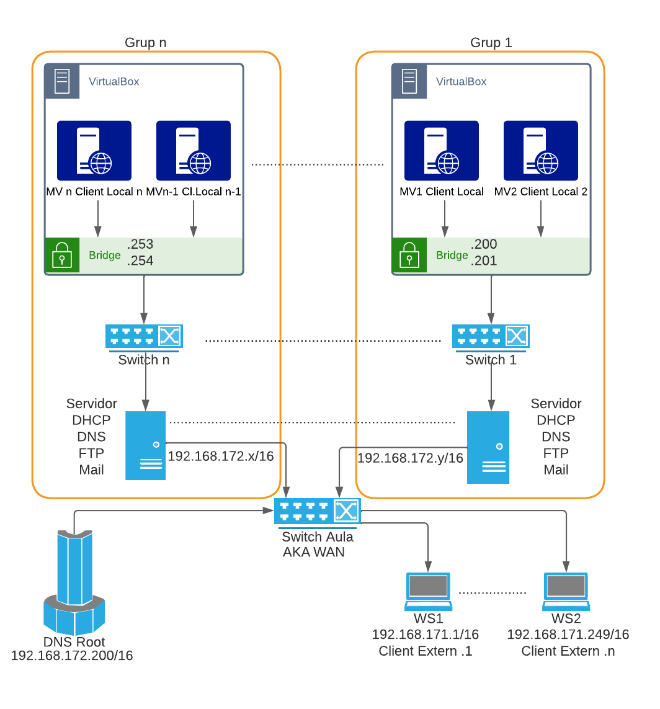

# Projecte 1 — Serveis d'infraestructura de xarxa

**Durada**: 36 hores (incloent l'extensió opcional Ruta A) o repartides amb el Projecte 2 si trieu Ruta B.

## Objectius

Muntar la infraestructura de serveis d'un petit proveïdor (ISP) que ofereix a clients externs:

- Configuració IP automàtica per a la seva xarxa interna.
- Resolució de noms per als seus dominis.
- Transferència de fitxers per FTP (anònim per al públic i personal amb quota per als clients).
- Hostatge web amb balanceig de càrrega i xifratge TLS.
- Correu electrònic amb xifratge TLS.

Tot el que apliqueu aquí ho heu vist als RA1 a RA6, RA7 i RA8. Aquest projecte no introdueix teoria nova; és el **muntatge integrat** dels serveis que ja coneixeu, dins una xarxa que simula un ISP dins de l'aula.

## Escull la teva ruta

Cada grup tria **una** de les dues rutes següents, i s'hi manté fins al final:

| Ruta | Què fa | Total hores |
|---|---|---|
| **A — Projecte 1 complet** | Nucli obligatori + Squid (proxy directe) + **Virtualmin** (panel d'ISP) | 36 h |
| **B — Projecte 1 parcial + Projecte 2** | Nucli obligatori (sense Squid ni Virtualmin) + Projecte 2 (Proxmox + Guacamole) | 36 h combinats |

- Els grups de Ruta A **només** fan aquest document.
- Els grups de Ruta B fan **la part obligatòria** d'aquest document i, després, el `Projecte2.md`.

## Metodologia de treball

1. El projecte es fa en **grups de 2 o 3 persones**.
2. Cada grup té un **portaveu setmanal** que fa totes les consultes al professor. Les consultes es fan a la taula del professor, que no anirà al vostre lloc de treball a resoldre problemes. Prepareu bé la pregunta i anoteu bé la resposta per transmetre-la als vostres companys quan us toqui el rol.
3. S'entreguen dues coses:
    - Un **document PDF** amb les instruccions estrictament necessàries per assolir l'objectiu.
    - Un **vídeo** on es mostri el funcionament del projecte. No cal veu si no la voleu.
4. La nota surt de la **mitjana ponderada** entre autoavaluació (20%), co-avaluació (30%) i avaluació del professor (50%). Si hi ha una diferència de tres punts o més entre les vostres i la del professor, les vostres no compten.
5. A més de la nota del projecte, cada membre del grup ha de contestar el **questionari** corresponent (`Questionari-Projecte1-Base.md` per a tothom i, si feu Ruta A, també `Questionari-Projecte1-Extensio.md`). Serveix per validar que **cada membre** ha treballat i coneix el projecte.

## Escenari de xarxa



> L'esquema és una **simplificació**: mostra el servidor com un únic bloc "DHCP + DNS + FTP + Mail" i les MVs internes com a clients. Al Projecte 1 fusionat, el mateix servidor també allotja **Nginx** com a frontal HTTP/HTTPS, amb **2 backends Apache** dins de la LAN interna. Els grups de Ruta A hi afegeixen a més **Squid** i **Virtualmin**.

L'aula simula Internet. El professor gestiona un **DNS Root** que fa d'"arrel de la simulació" i té assignada una IP fixa a la WAN de l'aula.

Cada grup munta la seva pròpia infraestructura:

- **1 servidor Ubuntu** (proporcionat pel professor o virtualitzat) amb **dues interfícies de xarxa**:
  - Una connectada a la **WAN de l'aula** (rol externa).
  - Una connectada al **switch privat del grup** (rol interna).
- **1 switch** físic o virtual per la LAN del grup (proporcionat pel professor).
- **Màquines virtuals** del grup connectades al switch en mode **pont** (bridge) — són els clients interns.
- **Clients externs** (portàtils o VMs amb bridge cap a la WAN de l'aula) — són els que "compren" els vostres serveis.

### Nomenclatura d'IPs (orientativa)

Aquestes IPs són una proposta. **El professor us donarà la IP de servidor concreta i el número de grup** al començament del projecte. Adapteu la nomenclatura a la que us hagi donat.

| Element | Rang / IP orientatiu |
|---|---|
| WAN de l'aula (Internet simulada) | `172.16.0.0/16` |
| DNS Root (professor) | `172.16.200.200/16` |
| Servidor del grup, interfície WAN | `172.16.<numGrup>.1/16` |
| Clients externs (WSx) | `172.16.171.x/16` |
| LAN interna del grup | `192.168.<numGrup>.0/24` (l'elegeix el grup) |
| Servidor del grup, interfície LAN | `192.168.<numGrup>.1/24` |
| Clients interns del grup (per DHCP) | `192.168.<numGrup>.50` – `.150` |

### Avís sobre IPs duplicades

**Aneu molt en compte amb les IPs duplicades a la WAN de l'aula**: si dos grups agafen la mateixa IP a la WAN, cauran tots dos i afectareu la resta. Aquest tipus d'errada es considera **greu** i baixa nota. Abans de connectar el cable a la WAN, valideu amb el professor que la vostra IP és única.

---

## Nucli obligatori (per a tothom)

### DHCP intern

- Configureu **`isc-dhcp-server`** al vostre servidor perquè assigni IPs dinàmiques a les màquines de la vostra LAN interna.
- Rang aprox. `192.168.<numGrup>.50` – `.150`.
- **Gateway** = la IP del servidor a la LAN interna (`.1`).
- **DNS servers** = el vostre propi servidor DNS (una vegada configurat) + fallback opcional.

### DNS

- Configureu **BIND9** com a servidor **autoritatiu** per als vostres dominis.
- Trieu **3 dominis** (sempre acabats en `.edu` per limitacions del DNS Root) — per exemple `grup5.edu`, `mercats.edu`, `bicis.edu`.
- Demaneu al professor que els **doni d'alta** al DNS Root. Us donarà la IP que faran servir els clients externs per arribar-hi.
- El vostre DNS ha de **reenviar** al DNS Root qualsevol consulta que no sàpiga (forwarders) i ser **autoritatiu** per als vostres dominis.
- Configureu **registres A** (per als serveis: `www`, `ftp`, `mail`), **MX** (per al mail), i el registre `PTR` si voleu tenir reverse DNS.
- Els vostres clients interns han de fer servir aquest DNS (l'assigneu via DHCP).

### FTP

Feu servir **[ProFTPD](https://www.proftpd.org/)** (a la pràctica RA3 vau fer servir vsftpd; aquí passem a ProFTPD, que és més potent i modular).

- Un lloc **anònim** (només lectura) accessible per qualsevol client de la WAN, per baixar manuals i publicitat de la vostra empresa.
- Un lloc **d'usuaris autenticats** (lectura i escriptura) per als vostres clients, amb el seu propi directori privat.
- **Quota de 5 GB** per client (mireu els mòduls `mod_quotatab` i similars).
- Els accessos han d'anar per **FTPS** (FTP sobre TLS). Genereu un certificat autofirmat (com a l'RA5).

### HTTP/HTTPS amb Nginx com a proxy invers + balancejador

- Munteu **2 servidors Apache backend** en dues màquines virtuals de la vostra LAN interna, servint contingut estàtic diferenciable ("Sóc el servidor 1", "Sóc el servidor 2").
- Al vostre servidor principal, munteu **[Nginx](https://nginx.org/)** com a **proxy invers** cap als 2 backends amb un `upstream` i balanceig round-robin.
- Nginx ha d'escoltar a **HTTP (80)** i **HTTPS (443)**. Genereu certificat autofirmat per al vostre domini. Redirigiu HTTP → HTTPS.
- Configureu almenys 3 **virtual hosts** (un per cada domini que hagueu registrat al DNS Root).
- **Exercici avançat**: configureu la ponderació `weight` perquè un backend rebi el doble de peticions que l'altre.

### Correu electrònic

- Munteu **Postfix** com a MTA i **Dovecot** com a MDA (IMAP + POP3) al vostre servidor.
- Creeu comptes de correu per als membres del grup, format `nom@<domini>.edu`.
- Configureu **TLS** (STARTTLS a 25/587/143/110 i implícit a 465/993/995).
- Genereu un certificat autofirmat amb SAN cobrint els noms `mail.<domini>`, `smtp.<domini>` i `imap.<domini>`.
- Els clients externs han de poder **enviar** i **rebre** correus amb un client de correu (recomanem **Evolution** — Thunderbird recent rebutja certificats autofirmats).
- El registre **MX** del DNS ha d'apuntar al vostre servidor de correu.

## Procediment recomanat

Treballeu amb **ordre i calma**. No proveu de tenir-ho tot funcionant a la vegada; construïu-ho per capes.

1. Demaneu al professor la IP del vostre servidor, els 3 dominis registrats al DNS Root i el número de grup.
2. Instal·leu i configureu el servidor Ubuntu amb les dues interfícies. Poseu la WAN temporalment en NAT si cal per instal·lar programari, i després passeu-la a bridge cap a la WAN de l'aula.
3. Configureu **DHCP intern**. Comproveu amb un client de la LAN que rep IP.
4. Configureu **DNS** (autoritatiu + forwarders). Comproveu amb `dig` des dels clients interns i externs.
5. Configureu **FTP** (anònim + usuaris amb quota + FTPS). Comproveu amb `curl -k ftps://…` o `lftp`.
6. Configureu els **backends Apache** i el **Nginx frontal**. Comproveu amb `curl` que Nginx serveix els backends i que el balanceig funciona. Afegiu HTTPS.
7. Configureu **Postfix + Dovecot amb TLS**. Comproveu amb `openssl s_client -connect …` i amb Evolution des d'un client extern.
8. Mostreu al professor el funcionament complet i entregueu.

## Ruta A — Extensió del Projecte 1 (només per als grups que trien Ruta A)

Els grups que fan Ruta A afegeixen dos serveis al nucli obligatori. Els que fan Ruta B **no fan aquesta secció** i passen al `Projecte2.md`.

### Squid (proxy directe per als clients interns)

- Instal·leu **[Squid](https://www.squid-cache.org/)** al vostre servidor.
- Configureu-lo com a **proxy directe** perquè els vostres clients interns hi surtin per accedir a la WAN.
- **Bloquegeu** almenys aquestes categories:
  - 3 dominis d'oci (a la vostra elecció: xarxes socials, streaming...).
  - Descàrregues d'executables (`.exe`, `.msi`, `.bat`).
  - Franja horària: només poden navegar de dilluns a divendres de 8:00 a 15:00.
- **Registreu** els accessos a `/var/log/squid/access.log` i mostreu al professor com llegir-lo.
- Els clients interns han de configurar el proxy als seus navegadors (o via WPAD si voleu bonus).

### Virtualmin (panel d'ISP)

L'objectiu és transformar la vostra infraestructura en un **panel autogestionat**: en comptes de crear comptes de correu, dominis o webs a mà, un client de la vostra empresa entra al seu panel i s'ho munta ell mateix — exactament com fa un ISP real.

Instal·leu **[Virtualmin](https://www.virtualmin.com/)** (versió GPL, gratuïta) sobre el vostre servidor Ubuntu. Virtualmin s'integra amb Apache, Postfix, Dovecot, BIND i ProFTPD/vsftpd — tot el que ja teniu muntat.

**Important**: Virtualmin acostuma a voler gestionar els serveis pel seu compte. Podeu fer una de dues coses:

- **Opció neta (recomanada)**: instal·leu Virtualmin en un servidor Ubuntu **fresc** amb l'script oficial, i deixeu-lo configurar-ho tot ell. La vostra part manual (nucli obligatori) queda al servidor anterior com a demostració; Virtualmin fa la mateixa feina al seu.
- **Opció integrada**: instal·leu Virtualmin al mateix servidor i el connecteu als serveis ja configurats. Més difícil però didàcticament més potent — descobrireu on Virtualmin no vol la vostra config i on sí. Podeu demanar consell al professor.

Guia d'instal·lació ràpida:

```bash
wget https://software.virtualmin.com/gpl/scripts/virtualmin-install.sh
sudo /bin/sh virtualmin-install.sh
```

L'script demana confirmació i triga entre 10 i 30 minuts.

Un cop instal·lat, accediu al panel a `https://<IP_servidor>:10000/`.

**Objectius mínims a demostrar**:

1. Creeu un **compte d'administrador** de Virtualmin (per a vosaltres).
2. Creeu un **domini virtual** (per exemple `client1.<domini>.edu`) i, dins seu, un **usuari final** amb accés al seu panel propi.
3. L'usuari final ha de poder, des del seu panel:
    - Crear-se **comptes de correu** (`info@client1...`, `admin@client1...`).
    - Pujar una **pàgina web** (`index.html`) i veure-la al domini.
    - Veure el seu **espai FTP**.
4. Documenteu al vídeo el flux complet: administrador crea client → client entra al seu panel → client crea correu → l'usa des d'un client extern (Evolution) → client puja una web → es veu al navegador.

## Entrega

Cada grup entrega:

- Un **PDF** amb totes les instruccions estrictament necessàries per replicar el projecte (com si fos un manual per a un futur administrador).
- Un **vídeo** on es demostri:
    - Client intern rep IP per DHCP i navega.
    - Consultes DNS resolen els vostres dominis.
    - Un client extern puja/baixa fitxers per FTPS.
    - Un client extern navega als vostres sites amb HTTPS (i s'aprecia que hi ha balanceig).
    - Un client extern envia i rep correu amb TLS.
    - **Ruta A**: Squid bloqueja el que ha de bloquejar; Virtualmin permet a un usuari-client crear-se correu i pujar web.
- Cada membre del grup entrega, individualment, les respostes del **questionari** corresponent (base per a tothom, extensió per als de Ruta A).

## Recursos

- [ProFTPD — documentació](http://www.proftpd.org/docs/)
- [Nginx — proxy_pass i upstream](https://nginx.org/en/docs/http/ngx_http_upstream_module.html)
- [Postfix TLS README](http://www.postfix.org/TLS_README.html)
- [Dovecot SSL configuration](https://doc.dovecot.org/2.3/configuration_manual/ssl/)
- [Squid ACLs](https://wiki.squid-cache.org/SquidFaq/SquidAcl)
- [Virtualmin — instal·lació GPL](https://www.virtualmin.com/download/)
- [Virtualmin — documentació](https://www.virtualmin.com/documentation/)
